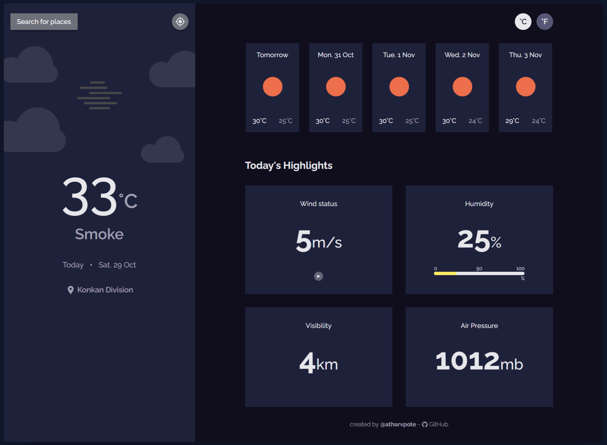

# Weather App

Solution for a challenge from [Devchallenges.io](http://devchallenges.io).

[Demo](https://getweather-app.vercel.app/) |
[Solution](https://github.com/atharvpote/weather-app) |
[Challenge](https://devchallenges.io/challenges/mM1UIenRhK808W8qmLWv)

## Table of Contents

- [Overview](#overview)
  - [Built With](#built-with)
- [Features](#features)
- [How to use](#how-to-use)
- [Acknowledgements](#acknowledgements)
- [Contact](#contact)

## Overview



This is a fast and simple web app that tells you about the weather details of your city. It can detect you location or you can also search of other locations get weather details. The applications is built with [Next JS](https://nextjs.org/) for the best performance and uses [OpenWeatherMap](https://openweathermap.org/) to get the most up yo date weather information. To get this data it uses [SWR](https://swr.vercel.app/) data fetching library to make the app as performant as possible. You can try the app on [here](https://getweather-app.vercel.app/)

### Built With

- [Next JS](https://nextjs.org/)
- [Tailwind](https://tailwindcss.com/)
- [SWR](https://swr.vercel.app/)

## Features

- Get the weather information about your current location
- Search for weather information of any other city
- Get the weather information about next 5 days
- Get the date and location of the weather information
- Different thumbnails for different weathers
- Get the min and max degree temperature of next 5 days
- Get the wind status and wind direction
- Get the humidity information
- Get visibility information
- Get the air pressure information
- Get the precise information for your current location
- Temperature information in both Celsius and Fahrenheit

## How To Use

To clone and run this application, you'll need [Git](https://git-scm.com), [Node.js](https://nodejs.org/en/download/) and [yarn](https://yarnpkg.com/) installed on your computer. From your command line:

```bash
# Clone this repository
$ git clone https://github.com/atharvpote/weather-app.git

# Install dependencies
$ yarn install

# Build the app
$ yarn build

# Run the app
$ yarn start
```

## Acknowledgements

- [Next JS](https://nextjs.org/)
- [Tailwind](https://tailwindcss.com/)
- [SWR](https://swr.vercel.app/)
- [OpenWeatherMap API](https://openweathermap.org/api)
- [Geo DB Cities](http://geodb-cities-api.wirefreethought.com/)

## Contact

- GitHub [@atharvpote](https://github.com/atharvpote)
